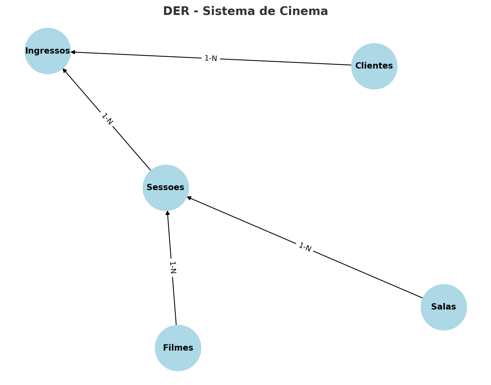

# 🎬 Projeto SQL – Sistema de Cinema  

## 📌 Objetivo  
Este projeto tem como finalidade **modelar e implementar um banco de dados para um sistema de cinema fictício**, permitindo o gerenciamento de:  
- Filmes  
- Clientes  
- Salas  
- Sessões  
- Ingressos  

Com ele é possível realizar consultas como: receita por filme, total de ingressos vendidos por sala e clientes mais frequentes.  

---

## 🗂 Estrutura do Projeto  

O repositório contém os seguintes arquivos:  

- `create_tables.sql` → Criação das tabelas do sistema de cinema.  
- `insert_data.sql` → Inserção de dados fictícios (filmes, clientes, salas, sessões e ingressos).  
- `queries.sql` → Consultas SQL para análise de dados do cinema.  

---

## 🛠 Tecnologias Utilizadas  

- **PostgreSQL** (banco de dados relacional)  
- **SQL** (DDL e DML)  

---

## 🏗 Modelagem do Banco de Dados  

### Entidades e Relacionamentos  
- **Filme (1) → Sessão (N)**  
- **Sala (1) → Sessão (N)**  
- **Sessão (1) → Ingresso (N)**  
- **Cliente (1) → Ingresso (N)**  

---

## ▶️ Como Executar  

1. Clone este repositório:  
   ```bash
   git clone https://github.com/seu-usuario/cinema-database.git
   cd cinema-database

2. Crie o banco de dados no PostgreSQL:
    CREATE DATABASE cinema_db;

3. Execute os scripts na seguinte ordem:
    create_tables.sql
    insert_data.sql
    queries.sql

## 📊 Exemplos de Consultas
    🎥 Receita total por filme
            SELECT f.titulo, SUM(i.valor) AS receita_total
            FROM ingressos i
            JOIN sessoes s ON i.id_sessao = s.id_sessao
            JOIN filmes f ON s.id_filme = f.id_filme
            GROUP BY f.titulo;

    🏟️ Total de ingressos vendidos por sala
            SELECT sa.numero, COUNT(i.id_ingresso) AS total_ingressos
            FROM ingressos i
            JOIN sessoes s ON i.id_sessao = s.id_sessao
            JOIN salas sa ON s.id_sala = sa.id_sala
            GROUP BY sa.numero;

    👥 Clientes que mais compraram ingressos
            SELECT c.nome, COUNT(i.id_ingresso) AS total_compras
            FROM ingressos i
            JOIN clientes c ON i.id_cliente = c.id_cliente
            GROUP BY c.nome
            ORDER BY total_compras DESC;


## 🖼 Diagrama do Banco de Dados  

- Filmes (1) → Sessões (N)
- Salas (1) → Sessões (N)
- Sessões (1) → Ingressos (N)
- Clientes (1) → Ingressos (N)




## 🚀 Próximos Passos
    Criar views para relatórios frequentes (ex: ocupação média por sessão).
    Adicionar restrições extras (ex: não permitir assentos duplicados na mesma sessão).
    Simular integração com uma aplicação de venda de ingressos online.
